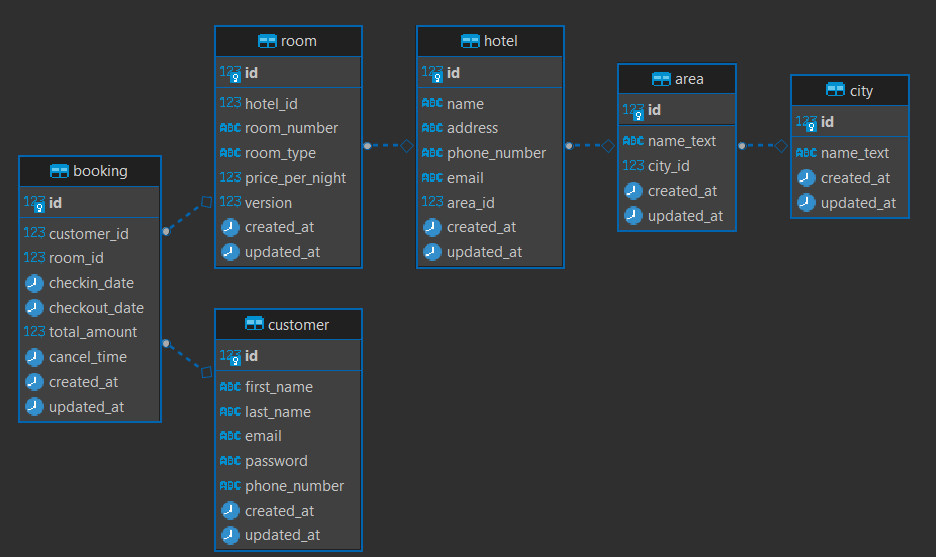
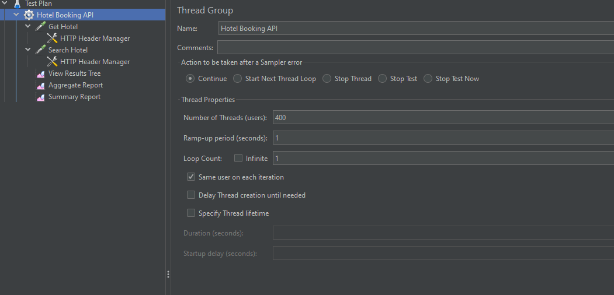
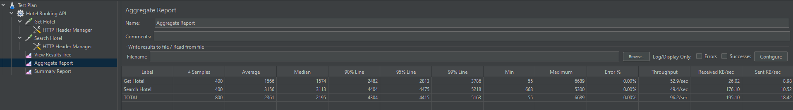

# Hotel Booking API


## API Document
Access this link to get API document (Include success testcases)
- [API Document](https://documenter.getpostman.com/view/11864108/2s9Ykhh4VD)

## Technical stack
- Java 11
- SpringBoot
- Postgre
- Elasticsearch
- Docker

## User Manual
### Deplendencies
- docker

### Steps
To start the project, run
```
./start.sh
```
To stop the project, run
```
./stop.sh
```

## Design
DB Design


## Test
### Stress Test
Configuration


Result


## TODO LIST
- Write unittest (Target min 85%)
- Improve authen and author (currently using basic authen)
- Using cache (Redis, ...) to improperformance (reduce traffic for DB)
- Develop Log service to handle log, for further anilysing
- Improve hotel search (search with long, lat by using PostGIS)
- Improve booking service (use message queue with microservices, ...) to data consistance when booking (Currently using optimistic lock)
- Build CI/CD